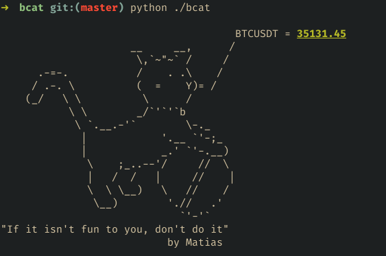

# Binance CAT
Just a Ascii Cat to show the current currencies price from Binance.
I was bored in a Saturday afternoon, so... That is it

**Preview**


### Requirements

## How to install

Clone this repo and run:

**install requirements**

```bash
    cd .\bcat
    pip install -r requirements.txt
```

**Run for default currency BTCUSDT**

```bash
    python .\bcat #Default ticket BTCUSDT
```

**Run for another currency**

```bash
    python .\bcat ETHUSDT
```
